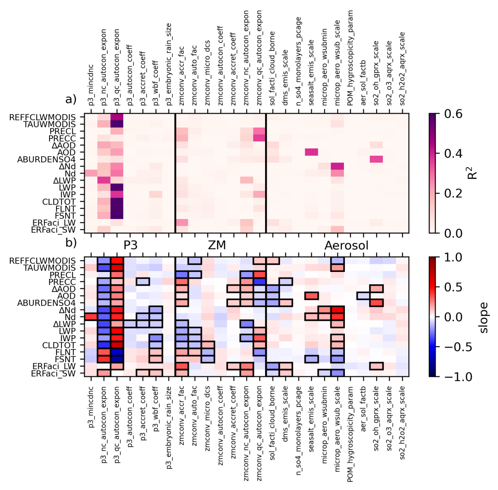
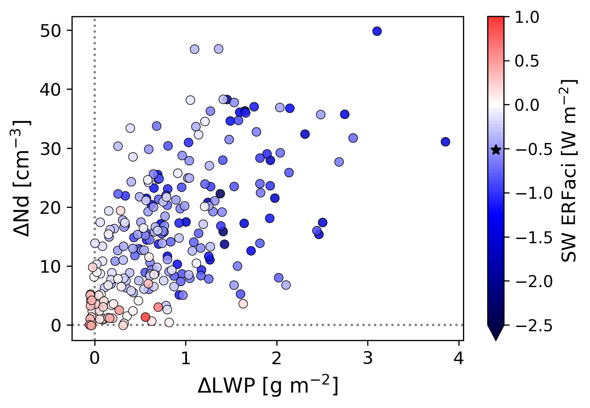
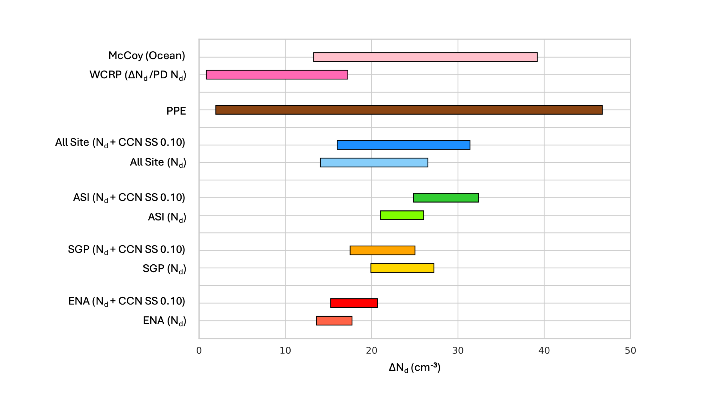

Selected PROCEED Research Results
=================================

Nephele E3SMv3 PPE
------------------

   **Nephele E3SMv3 PPE global mean physical behaviors.** Linear regression (a) r2 value and (b) slope for global mean behaviors (y-axis) on perturbed parameters  parameters (x-axis). Solid boxes in (b) indicate results that fall within the 95% confidence interval. Figure from `Nugent et al. (2025) <https://doi.org/10.22541/essoar.174907165.57104591/v1>`_.

   **Nephele E3SMv3 PPE preindustrial (PI) to present-day (PD) change in global mean quantities.** PI to PD changes (∆=PD-PI) in cloud drop number concentration (Nd) and liquid water path (LWP) shaded by shortwave effective radiative forcing from aerosol-cloud interactions (ERFaci). Each dot represents an ensemble member. The default configuration of E3SMv3 is shown in the larger dot and star in the color bar. Figure from <a class="reference external" href="https://doi.org/10.22541/essoar.174907165.57104591/v1">Nugent et al. (2025)</a>.

   **ARM observational constraints on higher end of expert assessed ∆Nd.** Observational constraints of ΔNd using the multi-linear regression (MLR) for Nd and surface CCN at supersaturation 0.1% as well as a simple regression using just Nd for each of the sites. Each bar represents the 90% confidence interval. Figure from `Jones et al. (2025) <https://doi.org/10.22541/essoar.175087280.06595777/v1>`_.

Hephaestus E3SMv3 PPE
---------------------
Coming soon!

